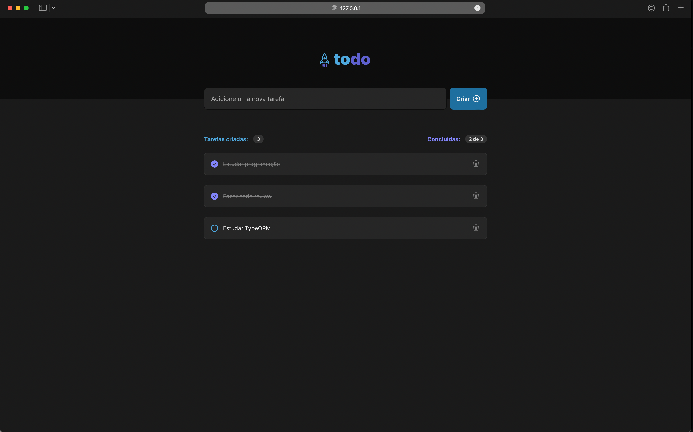

<h1 align="center">
	
</h1>

## 👨🏻‍💻 Hi everyone, This is a simple project to train my skills

To make this project more organized, I use ReactJS and Vite

## 👨🏻‍💻 To run this project

You only need to run "yarn" to install the node dependencies and use the command "yarn dev"

## 📝 License

This project is licensed under the MIT License - see the [LICENSE](LICENSE) file for details.

---

Made with 💜 &nbsp;by Gustavo Serão 👋 &nbsp;[See my linkedin](https://www.linkedin.com/in/gustavoserao/)
